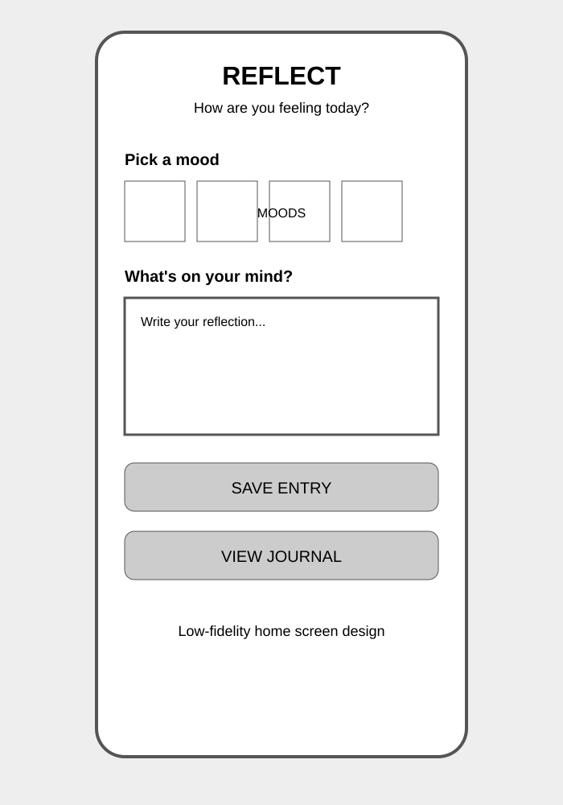
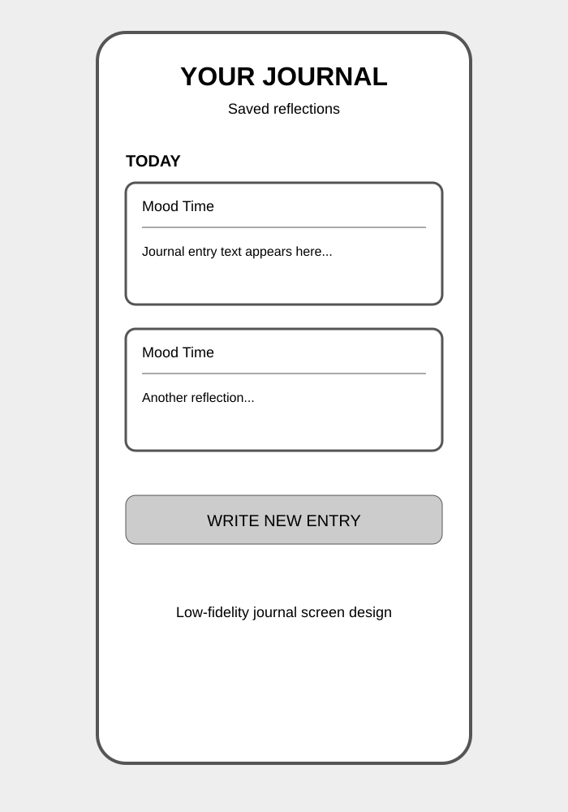

# Reflect

Reflect is a simple personal journaling app built with React Native and Expo.

The app lets users choose their current mood, write a private reflection, save it, and view previously saved journal entries.

## Features

- Choose a mood before writing an entry.
- Write a journal reflection using a text input.
- Save entries locally on the device.
- View saved entries grouped by date.
- Highlight the newest saved entry when navigating to the journal.
- Receive visual feedback after saving.
- Receive haptic feedback after successfully saving an entry.
- Navigate between screens using Expo Router.

## Screens

### Home / New Reflection

The main screen lets the user select a mood and write a reflection.

### Your Journal

The journal screen displays saved reflections grouped by date.

## Technologies and Packages

- React Native
- Expo
- Expo Router
- Expo Haptics
- Expo Status Bar
- Expo Vector Icons
- AsyncStorage
- TypeScript

### Extra Expo Packages Used

1. `expo-haptics` — provides haptic feedback after successfully saving a journal entry.
2. `expo-status-bar` — controls the appearance of the device status bar.

`@expo/vector-icons` is also used throughout the application for mood and navigation icons.

## State and User Interaction

The application uses `useState` for mood selection, text input, save feedback, entry counts, and saved-entry tracking.

It uses `useEffect` to refresh the saved-entry count and `useFocusEffect` to refresh journal entries when the journal screen receives focus.

## Data Passing Between Screens

The application uses Expo Router route parameters to pass the ID of the newest saved entry from the home screen to the journal screen.

The journal screen reads this parameter and highlights the corresponding entry.

## Low-Fidelity Designs

The original low-fidelity screen designs are included below.

### Home Screen Design

### Journal Screen Design

## Component Structure

Reusable UI components are stored in the `components` directory:

- `Header.tsx`
- `MoodPicker.tsx`
- `PrimaryButton.tsx`
- `EntryCard.tsx`

Application storage and date utilities are stored in `utils/storage.ts`.

## Project

**Project:** Reflect  
**Platform:** React Native + Expo  
**Language:** TypeScript
